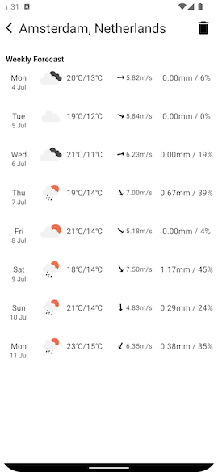
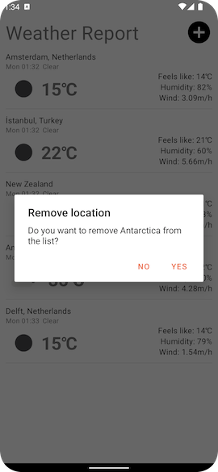

# RTL test project
This is the test project of Merve Gençer Tezyapar for the application to the role of Senior Android Developer at RTL.

## Description
The project's idea is to list weather reports of the selected locations and see the detailed view when clicked.

MVVM pattern is used for the structure.

The project is using [OpenWeather OnceCall API](https://openweathermap.org/api) for fetching weather reports, 
[GitHub Repos API](https://docs.github.com/en/rest/reference/repos) for fetching contributors of a repository and 
[GitHub Releases API](https://docs.github.com/en/rest/reference/releases) for fetching the latest release tag of a specific repository.

Here are some images on different screens:

**Used Libraries**
- [Room](https://developer.android.com/jetpack/androidx/releases/room) for persistence
- [Retrofit](https://square.github.io/retrofit/) for network calls
- [OkHttp-Logging-Interceptor](https://github.com/square/okhttp/tree/master/okhttp-logging-interceptor) for following network requests and responses on Logcat. This can be optimized on proGuard in the future
- [Glide](https://github.com/bumptech/glide) for image downloading and caching
- [Moshi](https://github.com/square/moshi) for making entities parcelable
- [Hilt](https://developer.android.com/training/dependency-injection/hilt-android) for dependency injection
- [Timber](https://github.com/JakeWharton/timber) for error logging
- [Hamcrest](http://hamcrest.org), [Robolectic](http://robolectric.org), [Mockito](https://site.mockito.org) and [Espresso](https://developer.android.com/training/testing/espresso) for unit and integration tests

**Android and Gradle Versions**
- compileSdk is 32
- minSdk is 21
- gradle version is 7.2.1

**Tests**
There is 1 test file in the project for the demonstration: 
- *WeathersRepositoryImplTest.kt* is for testing the functionality of repository *WeathersRepositoryImpl.kt* and is located under **test** folder.

